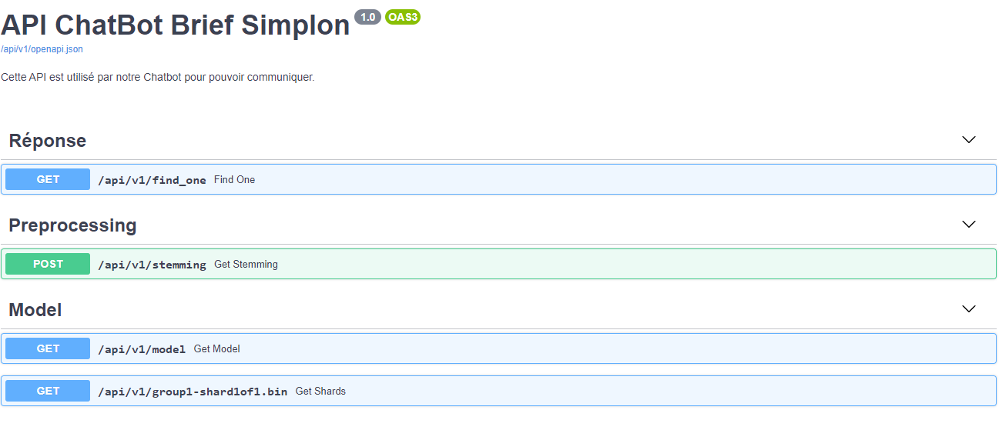
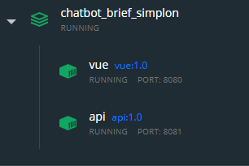

# Rapport Technique

## 1. Organisation du travail

Ce travail a été réalisé en groupe en utilisant la méthodologie SCRUM.  
Un rapport détaillé des étapes du projet est disponible : Voir le [rapport SCRUM](rapport_scrum.md).

Nous avons également utilisé la fonctionnalité `Project` de notre répertoire [Github](https://github.com/ChainYo/chatbot_brief_simplon/projects/1) pour gérer nos tâches et la répartition du travail.
<hr>

## 2. Recueil des données et intégration en base sur MongoDB Atlas

### Recueil des données

Le recueil des données est la première étape de la construction du ChatBot.  
Il consiste à établir la liste des grands thèmes d'intérêt, d'en extraire la liste des questions susceptibles d'être posées à notre ChatBot, et de trouver une réponse adaptée à chacune d'entre elles.

Pour ce travail de synthèse, nous nous sommes inspirés des sites internet de la formation et de simplon.co.

Plusieurs questions peuvent avoir la même réponse. Nous avons donc regroupé les questions par thème (sous forme de "tag"), et avons élaboré pour chaque `tag` une réponse adaptée.  

Ces données sont enregistrées au format **JavaScript Object Notation (JSON)**. Le JSON est un format de données textuelles qui permet de représenter simplement de l'information structurée compréhensible par la plupart des langages de programmation.

Voici un extrait de notre fichier `contents.json` :

```json
{
    "intents": [
        {
            "tag": "salutations",
            "patterns": [
                "Salut", 
                "Bonjour", 
                "Il y a quelqu'un ?",
                "Hey",
                "Hola",
                "Hello",
                "bjr"
            ],
            "responses": [
                "Bonjour ! Que puis-je faire pour vous ?",
                "Bonjour ! Comment puis-je vous aider ?"
            ],
            "context": [""]
        },
        {
            "tag":"program",
            "patterns":[
                "Quel est le contenu pédagogique ?",
                "Quel est le programme ?",
                "Que va-t-on apprendre ?",
                "Que fait-on en cours ?"
            ],
            "responses":[
                "Le contenu pédagogique est élaboré par..."
            ],
            "context":[""]
        }
    ]
}
```

Pour chaque situation sont définies :
- un tag, qui correspond à la classification de la situation,
- une liste de questions-types pouvant être posée par l'utilisateur se trouvant dans cette situation,
- une ou plusieurs réponse(s) pouvant être renvoyées par le ChatBot, ayant toutes la même valeur et répondant toutes de la même manière à la question posée.
- un contexte, permettant d'adapter le cas échéant la réponse du ChatBot à d'autres facteurs. Nous reviendrons plus en détails sur cette partie contexte dans la suite du rapport.

### Stockage de la BDD sur MongoDB Atlas

MongoDB est un des leaders des bases de données non-relationnelles, comme celle que nous avons à gérer dans ce projet. 

La base de données est hébergée sur `MongoDB Atlas` et l’accès à celle-ci se fait grâce au module `Motor` pour python.

```python
import motor.motor_asyncio
from model import Todo

client = motor.motor_asyncio.AsyncIOMotorClient(
    "mongodb+srv://<username>:<password>@<cluster-url>/?retryWrites=true&w=majority")
db = client['ChatDB']

async def find_answer(tag):
    data = await db.intents.find_one({"tag": tag}, {'_id': 0})
    return data
```

Dans la formulation de la requête nous utilisons `async`. Avec le traitement asynchrone, on peut exécuter les tâches en parallèle.  

`Async / await` sera très utile dans les cas où de nombreuses opérations d'Entrée / Sortie sont impliquées.

`AsyncIOMotorClient` est le client conseillé par MongoDB pour python. Après création d'une instance cliente, il suffit de se connecter à un `cluster` MongoDB existant et se connecter à une `collection` pour pouvoir interargir avec.

<hr>

## 3. Création du modèle IA

Avant  d'entraîner le modèle, le corpus qui constitue notre dataset pour l'entraînement est passé par plusieurs étapes de traitement:
- la tokenisation
- la suppression des stopwords et des caractère spéciaux
- la lemmatisation 

Une fois cela fait, nous avons créé notre vocabulaire ou liste de mots, notre liste de classes et notre document contenant les différentes questions (ou patterns) par classe.

### Choix techniques

On a choisit la lemmatisation plutôt que la méthode du stemming word car on obtennait de moins bons résultats avec cette dernière lors des tests du modèle.  

Pour l'entraînement un `ANN (Artificial Neural Network)` a été mis en place contenant une couche de 256 neuronnes, et une deuxième de 128 neuronnes et une troisième ayant un nombre de neuronnes équivalent au nombre de classes à prédire de notre dataset.

L'optimiseur `Stochastic Gradient Descent (SGD)` avec Nesterov accelerated gradient a été choisis pour ce modèle car cela fournissait de bons résultats.  

L'entraînement se fait sur `500 epochs` avec un `batch_size = 5`.

### Résultats

```bash
Epoch 500/500
13/13 [==============================] - 0s 11ms/step - loss: 0.0886 - accuracy: 0.9533 - val_loss: 3.6166 - val_accuracy: 0.5625
```

<hr>

## 4. Conversion du modèle Keras vers TensorFlow.js

### Coté Python

Installer TensorflowJS pour python :

```bash
pip install tensorflowjs
```

Après avoir créé et entrainé le modèle IA en python et keras, on le sauvegarde avec TensorFlow.js :

```python
import tensorflowjs as tfjs

tfjs.converters.save_keras_model(model, "tfjsmodel")
```

### Coté Javascript

On charge ensuite le modèle TensorFlow.js dans notre code JavaScript avec `tf.loadLayersModel('path/to/model')`, et on l'utilise avec `model.predict` :

```javascript
// Import du package TFJS
import * as tf from '@tensorflow/tfjs';

// Exemple du chargement du modèle
const model = await tf.loadLayersModel('https://foo.bar/static/tfjsmodel/model.json')
```

Nous utilisons notre API pour le chargement du modèle, nous avons donc :

```javascript
// Chargement du modèle
const model = await tf.loadLayersModel('http://localhost:8081/api/v1/model')

// Sauvegarde de la prédiction du modèle
let prediction = await model.predict(tf.tensor([this.tensor])).argMax(-1).data()
```

<hr>

## 5. API

### Docker-compose :

* Déploiement:

Lancez le terminal, placez-vous à la racine du dossier du projet et saisir la comande suivante:

```bash
docker-compose up -d
```

Une fois les deux containers lancés. Pour lancer l'api, il suffit de saisir cette adresse dans le navigateur : http://localhost:8081/

- Résultat:



Pour lancer la page web contenant le chatbot il faudrait saisir cette adresse dans le navigateur: http://localhost:8080/

* Le fichier Docker-compose:

```bash
version: "3.3"

services:
    api:
        image: api:1.0
        build:
            context: ./backend/app
            dockerfile: Dockerfile
        restart: unless-stopped
        container_name: api
        ports:
            - 8081:8081

    vue:
        image: vue:1.0
        build:
            context: ./frontend
            dockerfile: Dockerfile
        restart: unless-stopped
        container_name: vue
        ports:
            - 8080:8080
```

Le docker-compose crée deux images sur Docker, ainsi que deux containers.
La première `api` est le container lié au côté serveur, et la deuxième `vue` contient le côté client.




* Dépendances:

Le fichier Requirements.txt contient les librairies et modules utilisés pour la création de l'image `api`.
```bash
# notre fichier requirements.txt
fastapi
uvicorn
motor
dnspython
numpy
nltk
aiofiles
```
    - Uvicorn est un serveur "ASGI" ultra-rapide. Il exécute du code Web Python asynchrone en un seul processus.
    - Gunicorn Vous pouvez utiliser Gunicorn pour gérer Uvicorn et exécuter plusieurs de ces processus simultanés.

* Dockerfile:

Le fichier Dockerfile nous permet de préparer la mise en contenaire de l’API.
L’image Docker avec Uvicorn gérée par Gunicorn pour les applications Web FastAPI permet des performances non négligeables en Python 3.7.
Plus d’informations sur les liens suivant :  
- GitHub repo : https://github.com/tiangolo/uvicorn-gunicorn-fastapi-docker  
- Docker Hub image : https://hub.docker.com/r/tiangolo/uvicorn-gunicorn-fastapi/  

<hr>

## 6. Interface

L’interface web est intégralement réalisée vie `Vue3` qui est un framework front-end en Javascript.  


L’interface comprend la fenêtre du chat à travers laquelle l'étudiant ou le partenaire social peut dialoguer avec le bot pour obtenir des renseignements sur les formations et des réponses à ses différentes interrogations.


Il est possible de tester l'interface, pour cela suivez les instructions suivantes:

```bash
cd frontend/
npm install
npm run start
```

<hr>

## 7. Déploiement

Pour le déploiement de notre projet, nous avons choisi une instance EC2 tournant sous `Ubuntu-20.04`.  

Il nous aura simplement fallu installer `Docker`sur l'instance, puis d'effectuer les commandes suivantes :
>>>>>>> e8431e41d0bbabf8c811d17da0c5ac43f4d729be

```bash
# On récupère le dossier du projet
git clone https://github.com/ChainYo/chatbot_brief_simplon
# On se place dans le dossier cloné
cd chatbot_brief_simplon
# On lance l'application via Docker
docker-compose up -d
```