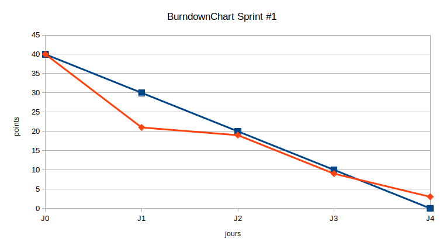
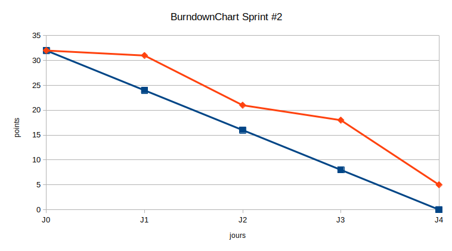

# Rapport SCRUM
 

## Sommaire

Sommaire :

- Identification des participants
- Product Backlog
- Sprint 1 :
    - Sprint Backlog
    - Revue du Sprint
    - Burndown Chart
- Sprint 2 :
    - Sprint Backlog
    - Revue du Sprint
    - Burndown Chart

Annexes :

- CR cérémonies
- Lien vers le Tableau de bord.

 

## 1. Identification des participants

__Product Owner__ : Thomas C.

>Le product owner a la responsabilité de produire et de maintenir à jour le carnet de produit. C'est lui qui détermine les priorités et qui prend les décisions d'orientation du projet.

__Scrum Master__ : Ludivine M.

> L'objectif principal du Scrum Master est de protéger l'équipe des perturbations extérieures. Il est complètement transparent pour la communication entre l'équipe et les clients et n'a aucun pouvoir hiérarchique sur l'équipe. C'est en revanche un facilitateur pour les problèmes non techniques de l'équipe.

__Equipe de développement__ : Luigi B., Jamal I, Thomas C, Ludivine M.

 

## 2. Product Backlog

Après la définition des User Stories, le Product backlog suivant a été réalisé. Le product backlog sert à établir la liste des fonction souhaitées, mais également à noter les amélioration et les correctifs qui doivent être faits pour que le produit final soit conforme aux exigences du client. A ce titre, il est évolutif et doit être modifié tout au long du projet.

C'est donc le product backlog _initial_, réalisé suite au poker planning, qui est présenté ci-dessous.

User Stories | Epic | Priorité | Estimation
:- |:-: |:-: | -:
je veux voir les messages s'afficher sur l'interface | Interface | 6 | 3
je veux une réponse à ma question en appuyant sur entrée | Interface |7 | 3
je veux une interface disponible à tous moments de la journée | Interface | 9| 3
Je veux qu'on s'adresse à moi différemment selon mon statut (étudiant ou partenaire) | Interface | 8 | 5
Je veux un délai de réponse inférieur à 1s. | Interface | 17 | ?
Je veux un mode sombre | Interface | 24 | 3
Je veux avoir l'impression de parler à une vraie personne | Interface | 29 | 20
Je veux avoir un historique des messages envoyés pour enrichir ma bdd | Interface | 18 | 5
Je veux pourvoir raconter des blagues comme avec siri | Interface | 30 | 5
Je veux que mon projet soit accessible de partout | Général | 27 | 5
Je veux que mes services soient déployables facilement (Docker) | Général | 28 | 5
Je veux rendre compte de mes choix techniques | Général | 22 | 5
Je veux rendre compte de l'application de ma méthodologie scrum | Général | 23 | 5
Je veux un modèle qui classifie les messages de mes utilisateurs | Modèle | 5 | 5
Je veux que mon modèle fonctionne sur Tensorflow.JS | Modèle | 15 | 3
Je veux un modèle adapté aux données: diversité des classes pour répondre aux possibilités d'interactions | Modèle | 16| 3 
Je veux que mon modèle puisse apprendre des ses erreurs et faire de l'auto apprentissage  | Modèle | 28 | 20
Je veux définir les endpoints | API | 10 | 1 
Je veux des endpoints adaptés au besoin du modèle et de l'interface | API | 11 | 1 
Je veux un endpoint pour obtenir une réponse en fonction d'un tag | API | 12 | 1 
Je veux une API qui soit disponible 100% | API | 13 | 1 
Je veux une documentation pour mon API | API | 14 | 1 
Je veux une api qui gère les codes erreurs | API | 19 | 3 
Je veux une api qui gère l'async | API | 20 | 1 
Je veux des tags dans mon corpus pour faciliter la classification| Corpus | 3 | 1
Je veux une banque de questions et de réponses | Corpus | 2 | 10 
Je veux que mon corpus soit stocké en base de données | Corpus | 4 | 3 
Je veux que mon corpus soit en français | Corpus | 1 | 1 
Je veux pouvoir poser des questions et obtenir des réponses en anglais  | Corpus | 25 | 5 
Je veux un choix de réponses élargi pour offrir de la diversité dans le dialogue  | Corpus | 21 | 3 

 

## 3. Sprint 1

### Sprint Backlog #1

Les User Stories retenues pour ce premier sprint sont les suivantes :

User Stories | Epic | Estimation | Terminé jour
:- |:-:| :-:| -:
je veux voir les messages s'afficher sur l'interface | Interface | 3 | 1
je veux une réponse à ma question en appuyant sur entrée | Interface | 1 | 1
je veux une interface disponible à tous moments de la journée | Interface | 3 | 4
Je veux un choix de réponses élargi pour offrir de la diversité dans le dialogue  | Corpus | 3 | 4
Je veux un modèle qui classifie les messages de mes utilisateurs | Modèle | 5 | 3
Je veux un modèle adapté aux données: diversité des classes pour répondre aux possibilités d'interactions | Modèle | 3 | 3
Je veux définir les endpoints (je veux une API) | API | 1 | 2
Je veux des endpoints adaptés au besoin du modèle et de l'interface | API |1 | 2
Je veux une API qui soit disponible 100% | API |1 | 3
Je veux une documentation pour mon API | API | 1 | 3
Je veux des tags dans mon corpus pour faciliter la classification| Corpus |  1| 1
Je veux une banque de questions et de réponses | Corpus |  10 | 1
Je veux que mon corpus soit stocké en base de données | Corpus |  3 | 1
Je veux que mon corpus soit en français | Corpus | 1 | 1
Je veux que mon modèle fonctionne sur Tensorflow.JS | Modèle | 3| Non réalisée

 

### Sprint Review #1

Le jours où ont été terminées chacune des tâches on été reportées dans le backlog ci dessus.

Une tâche n'a pas été terminée. Nous considérons que, ne connaissant pas la technologie concernée, nous avions essayé de l'intégrer trop en amont dans le déroulement du projet. Nous nous sommes informés sur ce dont il en retournait pendant le sprint, et avons choisi de repousser l'échéance au second sprint.

Nous considérons également qu'une tâche avait été surévaluée, compte tenu des resources et du temps qui ont été nécessaires à sa réalisation le premier jour. 

Pour 4 jours de travail, nous avions retenu un total de 40 points pour le premiers sprint. Compte tenu de nos résulats et du temps de travail restant (3,5 jours), nous réévaluerons cette capacité de travail à 32 points pour le second sprint.

 

### Burndown Chart #1

 

## 4. Sprint 2

### Sprint Backlog #2

Pour ce second sprint, compte tenu des résultats du premier, du temps restant (3,5j) et après discussion sur le travail restant, nous choisi de retenir un total de 32 points à réaliser.

Les User Stories retenues pour ce second sprint sont les suivantes :

User Stories | Epic | Estimation | Terminé jour
:- |:-:| :-:| -:
Je veux que mon modèle fonctionne sur Tensorflow.JS | Modèle | 3 | 3
Je veux qu'on s'adresse à moi différemment selon mon statut (étudiant ou partenaire) | Interface | 5 | Non terminée
Je veux un délai de réponse inférieur à 1s. | Interface | 3 | 4
Je veux que mon projet soit accessible de partout | Général | 5 | 2
Je veux que mes services soient déployables facilement (Docker) | Général | 5 | 2
Je veux rendre compte de mes choix techniques | Général | 5| 4
Je veux rendre compte de l'application de ma méthodologie scrum | Général |5| 4
Je veux une api qui gère l'async | API | 1 | 1

 

### Sprint Review #2

Un point de blocage important dès le deuxième jours du sprint nous a fait prendre du retard sur le planning. Ce bloquage était principalement dû à nos faibles connaissances en développement Frontend, et bien que la totalité de l'équipe ait été mobilisée sur le problème, nous n'avons pas pu le résoudre sans aide extérieure dans des délais raisonnables.  
La résolution est intervenue en fin de journée grâce à l'aide d'un formateur.

Un nouveau point blocant est apparu le troisième jour, nous faisant à nouveau prendre un retard considérable sur nos objectifs.

Ces retards cumulés nous ont obligés à revoir nos objectifs pour ce sprint et donc pour la totalité du projet.  
Après concertation lors de la dernière daily scrum, nous avons choisi d'ajourner l'une des fonctionnalités (voir la User Storie "non réalisée" dnas le Sprint Backlog ci dessus), afin de rendre un projet fonctionnel, même si nous ne répondons pas à la totalité du cahier des charges.

 

### Burndown Chart #2

 

## 5. Conclusion

Nous avons utilisé le cadre méthodologique SCRUM pour définir :
- les rôles de chacun, 
- un rythme de travail itératif, 
- des réunions précises et limitées dans le temps (planning pocker : 45mn, sprint planning : 1h, daily scrum : 15mn, sprint review : 30mn, ...),
- des outils de travail  (product backlog, sprint backlog, scrum boeard, burndown chart, ...).

Ce cadre de travail nous a permis de collaborer plus efficacement, de structurer notre travail, et finalement de tirer profit de ce projet par une montée en compétences de l'ensemble des participants sur toutes nos réalisations. 
Aborder le projet de manière agile nous a permis d'avoir plus de visibilité sur le travail de nos collègues et donc de partager facilement la même vision d'ensemble du produit.  
Le fait de revoir constamment les objectifs et l'avancée du projet (objectifs du jour, objectifs du sprint, etc.) permet d'éviter le stress et les écueils et d'avancer posément. 

Si l'ensemble des user stories que nous avions définies au début du projet n'ont pas été réalisées, nous avons pu prioriser notre travail pour remettre au client un produit fonctionnel dans le temps imparti.

La tâches du sprint 2 "non réalisée" et les tâches qui ne sont jamais rentrées dans aucun Sprint Backlog auraient pu être l'objet d'un 3ème sprint. Nous pensons, maintenant que nous avons un projet fonctionnel, que nous aurions pu répondre à l'ensemble des demandes client dans le temps du troisième sprint.  
Notre Product Backlog de départ comptait 133 point au total, dont 90 qui répondaients à des demandes client, et 43 à des options supplémentaires auxquelles nous avions pensé. Nous avion estimé notre force de travail à 40 et 32 points pour les deux premiers sprint, ce qui s'est avéré légèrement surestimé mais cohérent. Addition faite, un troisième sprint nous aurait probablement permis d'atteindre les objectifs clients.

Nous avons donc rempli notre contrat, et c'est sans aucun doute grâce aux méthodes agiles que nous avons pu y arriver sereinement.
 

## 6. Annexes et liens

Annexe 1 : [Comptes-Rendus des daily scrums](SCRUM/CR_daily.pdf)

Lien vers le [Scrum Board](https://github.com/ChainYo/chatbot_brief_simplon/projects/1)

